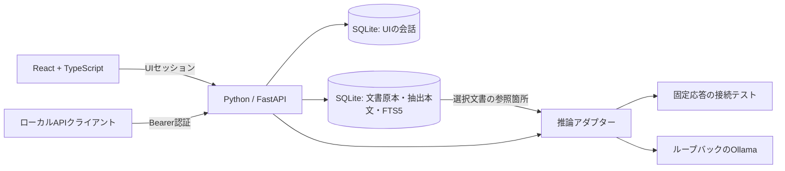

# 動作試作 0.1

要件定義書を基にした検証用の実装です。完成版やPhase 1受入済みとは扱いません。

## 構成



| ファイル | 役割 |
|---|---|
| [backend/__main__.py](../backend/__main__.py) | ポート確保、保存先の排他、ブラウザー起動 |
| [backend/app.py](../backend/app.py) | 認証、API、生成状態・キャンセル、静的画面配信 |
| [backend/inference.py](../backend/inference.py) | 接続テストとOllamaの切り替え |
| [backend/storage.py](../backend/storage.py) | SQLiteの会話・メッセージ保存 |
| [backend/knowledge.py](../backend/knowledge.py) | TXT・Markdownの登録、原本保存、行番号付き抽出、全文検索、削除 |
| [backend/config.py](../backend/config.py) | 保存先、ポート、推論接続先の検証 |
| [frontend/src/Workspace.tsx](../frontend/src/Workspace.tsx) | チャット・履歴・モデル選択・API画面 |
| [frontend/src/Knowledge.tsx](../frontend/src/Knowledge.tsx) | 文書登録・検索対象選択・削除、参照本文と原本リンク |

起動・停止は[README](../README.md#起動する)を参照してください。

## 実装済み

- 画面の一回限りの起動認証、HttpOnly・SameSite Cookieによるセッション。
- UIからの会話作成・一覧・タイトル検索・名称変更・JSON出力・完全削除。
- 固定応答テスト、Ollamaの登録済みモデル一覧とチャット接続。
- SSEによる逐次表示、キャンセル、生成失敗、再起動による中断状態の記録。
- 生成中は同時要求を拒否。推論接続はHTTPのIPリテラルのループバックのみ。プロキシ環境変数・リダイレクトを利用しない。
- 連携APIキーの発行・再発行・失効。連携キーではUIの会話・設定操作ができない。
- Host・Originの検証、UI変更操作への同一Origin要求、CSP、プレーンテキスト表示。
- 本文やキーを含めない要求ID・HTTP結果・生成結果の基本ログ。
- UTF-8のTXT・Markdownの画面からの登録、内容抽出、選択文書内の全文検索、原本取得・完全削除。
- RAGの参照箇所をOllamaへ渡す生成、原本ID・SHA-256・行番号・参照本文の表示と会話への保存。一致がなければ推論を行わず根拠不足を表示。

## API

実際の接続先はランチャーの表示に従います。既定は `http://127.0.0.1:8765`。すべての `/api/v1/` 操作には `Authorization: Bearer <key>` が必要です。

| メソッド | パス | 内容 |
|---|---|---|
| GET | `/api/v1/models` | 接続テストとOllamaの登録モデル一覧 |
| GET | `/api/v1/health` | サーバー状態と生成処理中かどうか |
| POST | `/api/v1/chat` | JSONまたはSSEによる生成。DBへの会話保存なし |
| POST | `/api/v1/generations/{request_id}/cancel` | 同じ認証主体の実行中生成を停止 |
| GET | `/api/v1/openapi.json` | 現在の要求スキーマ |

チャットの要求例:

```json
{
  "model": "demo-preview",
  "messages": [{ "role": "user", "content": "Hello" }],
  "temperature": 0.7,
  "max_tokens": 512,
  "stream": false
}
```

`model` に登録済みのOllamaモデル名を指定すると実際の推論を行います。`demo-preview` は固定応答で、`demo: true` を返します。入力ロールは `user` と `assistant` のみです。サーバーの指示はクライアントから上書きできません。

SSEは `start`（要求ID）、`delta`（本文断片）、`done`（最終結果）の順です。最終結果の `status` は `complete` / `cancelled` / `error` を区別し、失敗時は `error` に案内を含めます。`done` が来ず接続が終了した場合は成功扱いにしないでください。APIストリームの再接続・再試行は新規生成になるため、自動再送しないでください。

```bash
curl -N http://127.0.0.1:8765/api/v1/chat \
  -H "Authorization: Bearer $LOCAL_LLM_API_KEY" \
  -H "Content-Type: application/json" \
  --data '{"model":"demo-preview","messages":[{"role":"user","content":"Hello"}],"stream":true}'
```

キーは自分の環境で安全に渡し、実値を共有しないでください。停止要求にも同じキーを使用します。非ストリーミング時も応答ヘッダーの `X-Request-ID` が生成要求IDです。

| 状況 | HTTPステータス |
|---|---|
| 未認証・連携無効・期限切れ | 401 |
| 許可外Origin・UI操作のOrigin欠落 | 403 |
| 不正な接続先Host | 400 |
| 対象がない・他の認証主体の生成ID | 404 |
| 生成中の会話削除 | 409 |
| 要求サイズ・会話長の上限超過 | 413 |
| 型・範囲・未知の設定値 | 422 |
| 他の生成を実行中 | 429 |
| モデルが一覧にない・利用不可 | 503 |
| 非ストリーミング生成中の推論失敗 | 502 |

生成開始前のエラー形式は `{"error":{"code":"...","message":"...","request_id":"..."}}` です。開始後は最終結果の状態を確認します。取消済み生成の保持は次の生成までです。OpenAI完全互換APIではありません。

## 文書検索の試作

画面からの使い方と上限は[README](../README.md#文書をナレッジとして使う)を参照してください。SQLite標準機能のFTS5 trigramを使用し、追加モデルや外部サービスは使いません。選択した文書IDだけで検索し、3文字の検索語断片は最大64種類、検索結果は上位4箇所です。2文字の語だけの場合は正規化後の本文に対して部分一致検索します。検索品質の包括評価は未実施です。

原本は `LOCAL_LLM_DATA_DIR/knowledge.sqlite3` のBLOB、抽出本文と索引は同じDBに保存します。原本のバイト列のSHA-256で重複を検査し、登録は1トランザクションで原本・本文・索引を作成します。削除は外部キーと削除トリガーにより本文・索引を除去します。会話DBの生成時スナップショットやエクスポートは削除対象に含まれません。

| メソッド | 画面用パス | 内容 |
|---|---|---|
| GET | `/ui/documents` | 文書ID、名前、原本ハッシュ、登録日時、バイト数、抽出箇所数 |
| POST | `/ui/documents?name=...` | ボディに原本バイト列を送信（`application/octet-stream`）。UTF-8のTXT・MDのみ、80,000バイト以下 |
| POST | `/ui/documents/search` | JSONの `query`（2〜500文字）と `document_ids`（1〜20件）で検索 |
| GET | `/ui/documents/{id}/original` | 登録時の原本を添付ファイルとして返す。安全のため取得時の名前は固定の `.txt` |
| DELETE | `/ui/documents/{id}` | 原本・本文・索引の完全削除。生成中は409、未登録IDは404 |

上記はUIセッション必須です。変更操作には同一Originを要求し、Bearerキーだけでは利用できません。外部連携向けの文書管理・RAG APIは未実装のままです。

`POST /ui/conversations/{id}/chat` に `document_ids` を追加しました。省略・空配列なら通常チャットです。指定時は実モデル必須で、質問500文字・会話合計2,000文字を上限とします。参照箇所は最大2件・各700文字をサーバー側のRAGプロンプトへJSONとして渡します。文書の指示を実行しないようモデルへ指示しますが、プロンプトインジェクションの完全な防止を保証するものではありません。

RAGの最終SSEイベントには `rag: true`、`prompt_version: "rag-1"` と `references` を返します。参照項目は `citation`、`document_id`、`name`、`sha256`、`start_line`、`end_line`、`content` と抽出箇所の `id` です。参照箇所は会話メッセージの生成設定とともに保存し、再表示・エクスポートにも含めます。この一覧はモデルへ渡した本文であり、生成された引用番号や回答の正確性を自動検証した結果ではありません。

## 設定

| 環境変数 | 既定値 | 用途 |
|---|---|---|
| `LOCAL_LLM_DATA_DIR` | `%LOCALAPPDATA%\LocalLLMTemplate` | 用途別の保存ディレクトリ。初回起動前に分ける |
| `LOCAL_LLM_PORT` | `8765` | 優先する待受ポート。使用中なら後続の空きポートを探す |
| `OLLAMA_URL` | `http://127.0.0.1:11434` | 推論接続先。`http://[::1]:11434` も指定可能 |

秘密情報を環境変数の設定例やファイルへ記載しません。UIセッションは12時間、APIキーは1時間、起動リンクは5分・一回限りで、すべて再起動時に失効します。`--print-launch-url` はローカル自動テスト向けで認証情報を出力するため、通常起動やログを共有する場面では使わないでください。

## 既知の制約

- 2026-09-12にOllama 0.34.0と `qwen3:4b-instruct-2507-q4_K_M` を導入し、アプリAPIで日本語3ターン、ブラウザーで2ターンの会話と履歴再表示を確認しました。架空の名前・予定を保持して回答しています。短い回答の実測は初回約12秒、後続約3秒です。網羅的な品質評価・長文性能・必要メモリの測定は未実施です。導入・起動方法は[README](../README.md#実際のllmを使う)を参照してください。
- 全要件の受入試験、非開発者3名の導入試験、業務利用の承認は未実施です。
- TXT・Markdownの登録と全文検索型RAGは検証用に実装済みです。PDF・Excel・Wordの取り込み、意味検索、OCR、複数ユーザーの役割・権限管理、会話共有、バックアップ・復旧・モデル更新ロールバックは未実装です。Phase 2受入済みとは扱いません。
- 会話削除は完全削除で復旧できず、FR-02の論理削除・復旧期間要件は未達です。
- 通常運用のOS全体の外向き通信遮断、保存先のACL・暗号化検証、改ざん対策付き監査ログは未実装です。ブラウザーテストで外部リクエストが発生しないことと、OS全体で通信を禁止することは別です。
- APIは同時実行1件、要求100,000バイト以下、会話40メッセージ・24,000文字以下、出力上限50,000文字、生成120秒までです。モデルごとの厳密な入力トークン数の事前判定、リクエスト頻度制限、キュー、冪等性キーは未実装です。
- 失効・キャンセル時の停止はアプリ側で確認していますが、Ollama側のGPU資源解放期限は実機で未検証です。
- 生成途中の本文は完了・取消・失敗時に保存します。プロセスが強制終了した場合は途中の本文を失い、次回起動時に中断として表示します。
- 画面にはキーや認証情報を埋め込みません。初回の有効化・キー発行にはローカル画面が必要で、発行後のAPI呼び出しは画面なしで実行できます。
- 開発元の推奨配布ライセンス、すべての間接依存の配布義務・採用記録、オフライン配布物の整備は未完了です。正式な配布・業務利用前に別途確認してください。

## 開発・検証

Python依存の直接指定は [requirements.txt](../requirements.txt)、検証を含むWindows環境の固定版は [requirements-lock.txt](../requirements-lock.txt)、フロントの固定版は [frontend/package-lock.json](../frontend/package-lock.json) です。ライブラリの利用実績やライセンスを確認する入口は、[FastAPI](https://github.com/fastapi/fastapi)、[Uvicorn](https://github.com/encode/uvicorn)、[HTTPX](https://github.com/encode/httpx)、[React](https://github.com/facebook/react)、[Vite](https://github.com/vitejs/vite)、[eventsource-parser](https://github.com/rexxars/eventsource-parser) です。リンク先への接続は通常運用の必須処理ではありません。

```powershell
.\scripts\check.ps1 -InstallBrowser -Audit
```

2回目以降、ブラウザー導入とネットワークを使う依存監査が不要なら `.\scripts\check.ps1` だけで検証できます。`.tools` 内の固定版Node.jsを使用し、システムの古いNode.jsには依存しません。Pythonテストだけなら `.\.venv\Scripts\python.exe -m pytest tests -q` で実行できます。

ブラウザー導入・依存検査はネットワークを使う開発作業です。脆弱性検査はパッケージ名・版情報を照会します。Playwrightはテスト専用の一時保存先・空きポートで起動し、認証情報をテスト結果へ出力しません。スクリーンショットは `frontend/test-results/screenshots/` に生成します。

文書テストは不正入力、重複、検索範囲、行番号、再起動後の保持、削除を検証します。APIテストは文書操作の認証・Origin制限、RAG・出典保存、根拠なし応答、外部キーとの分離を確認します。ブラウザーテストはローカルのOllama互換模擬サーバーを用い、文書登録から検索・回答・出典・再表示・削除とデスクトップ／モバイル表示を検証します。

実際のOllamaと導入済み `qwen3:4b-instruct-2507-q4_K_M` によるRAGテストは明示的に実行します。通常のテストではスキップし、モデルの自動取得はしません。一時保存先と架空データを使い、既存データは変更しません。

```powershell
$env:LOCAL_LLM_LIVE_TEST = '1'
try {
  .\.venv\Scripts\python.exe -m pytest tests/test_api.py -k live_ollama_rag -q -s
} finally {
  Remove-Item Env:LOCAL_LLM_LIVE_TEST
}
```

2026-09-14の実機検証では、架空の受付コードZX-4827と締切23日を出典番号 `[1]` 付きで回答し、原本ハッシュ付きの参照箇所が履歴に保存されることを確認しました（約23秒）。品質・安全性の網羅的な評価ではありません。