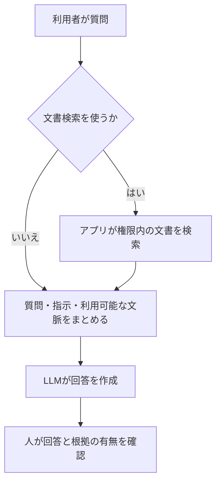
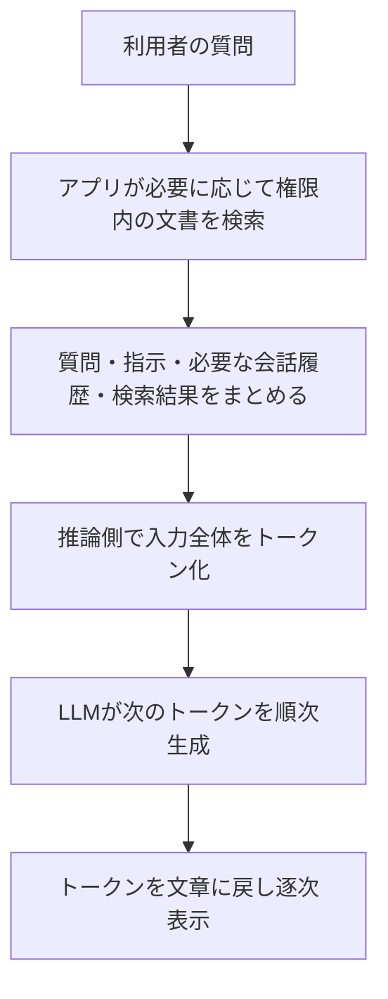
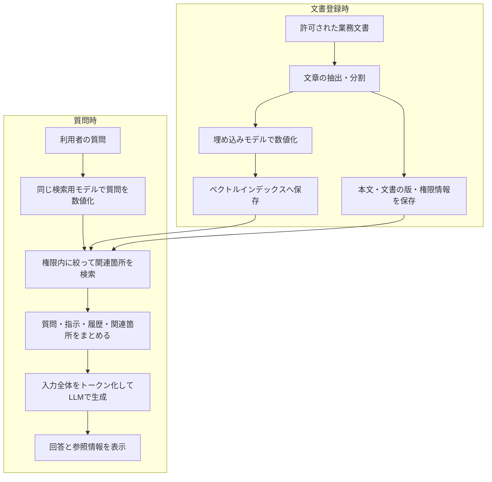

# template_local_llm_for_individual テンプレートリポジトリ要件定義書

- 文書版: 0.9
- テンプレート名: template_local_llm_for_individual
- リポジトリ名: template_local_llm_for_individual
- 派生アプリ名: テンプレート利用時に用途ごとに設定する
- 作成日: 2026-09-12
- 更新日: 2026-09-12
- 状態: レビュー指摘反映・承認待ち
- 対象: 非開発者を含む初回利用者が導入でき、個人のローカル検証から業務用途へ展開できるLLMアプリケーションのテンプレートリポジトリ

## 1. 文書の目的

本書は、インターネット上の外部サービスに依存せず、利用者の管理する環境で動作するローカルLLMアプリケーションを作るための、テンプレートリポジトリの目的、範囲、要求事項、受入基準を定義する。バックエンドはPython、フロントエンドはReactとTypeScriptを採用し、API機能を必須とする。モデル・推論エンジン・周辺ライブラリは選定基準に従って決定し、各構成要素の分離によって将来の交換に耐えられることを重視する。

本リポジトリは、特定業務向けの完成アプリではなく、用途ごとに複製し、モデル・設定・文書を差し替えて再利用する開発の出発点とする。ここでいうテンプレートは、プロンプトのひな形やLLMのモデル本体ではなく、共通のアプリケーション構成・設定例・導入手順・評価方法を含む。現時点ではチャットとAPIの動作試作があり、文書取り込みや全要件の受入は未完了である。[試作の実装範囲と制約](prototype.md)を本書の完成要件と区別して参照する。

### 「誰でも使える」の定義

特定の開発者・組織・業務に依存せず、LLMやプログラミングの知識がない人も、対応環境で配布物と手順書を使い、ソースコードを編集せずに最小チャットを導入・起動・停止・再利用できることを目標とする。前提知識はファイルの取得・展開と基本的なPC操作とし、Git操作や開発環境の構築経験を必須としない。

すべてのPC・OS・言語での動作や、無条件の業務利用を保証する意味ではない。対応OS、必要メモリ・空き容量、GPUの要否、対応言語、必要な権限、モデルの利用条件を導入前に示す。条件を満たさない場合は理由と対処を案内し、安全条件を緩めて起動しない。対応範囲はPhase 0で確定し、確認できた範囲だけを配布時に表示する。

### テンプレートと派生アプリの区別

- **テンプレート本体**: 共通コード、秘密情報を含まない設定例、導入・更新手順、架空のサンプルと評価ケースを管理する。特定の利用者や業務の実データは含めない。
- **派生アプリ**: テンプレートから作成する用途別のアプリケーション。アプリ名、モデル、プロンプト、保存先などを設定し、独立した環境で運用する。
- **本書の適用範囲**: FR-01〜FR-09・FR-12は派生アプリが各導入フェーズで満たす要件、FR-10・FR-11は再利用と初回導入を支えるテンプレート本体の要件とする。非機能要件は配布物・導入処理・派生アプリの該当部分に適用する。テンプレートの検証合格だけで、派生アプリの業務利用を承認したことにはしない。

### このテンプレートを一言でいうと

ローカルLLMを使うチャットアプリを作り、必要に応じて文書検索（RAG）へ拡張するための共通ひな形である。派生アプリでは、利用者の質問と、必要に応じて検索した登録済み文書の関連箇所をローカルLLMへ渡して回答を作る。

画面に加え、API（他のプログラムから機能を呼び出す窓口）を提供する。利用者が許可したローカルアプリやスクリプトから、画面を操作せずに質問と回答を扱える。APIを使わない利用者に、連携設定やプログラミングを要求しない。



LLMは回答を作成する役割、文書検索機能は業務情報を探す役割、人は回答を確認して最終判断する役割を担う。この役割分担を明確にすることで、仕組みを理解しやすく、安全に運用できるようにする。

## 2. 背景と目的

### 2.1 背景

- 業務データや個人情報を外部AIサービスへ送信できない、または送信を最小化したい。
- 利用目的に応じたモデル、プロンプト、検索対象を管理したい。
- ベンダーや特定モデルへの依存を避け、長期間継続利用したい。
- 回答品質、利用履歴、設定変更を追跡可能にしたい。

### 2.2 目的

1. 管理対象のPCまたは社内ネットワーク内でLLMを実行する。
2. 文書検索、要約、下書き作成、質問応答などの業務を支援する。
3. 入力データ、参照データ、出力データの境界を明確にする。
4. モデル更新・評価・ロールバックを安全に実施できるようにする。
5. 導入効果を品質・速度・コスト・安全性の指標で評価できるようにする。
6. 共通部分を再実装せず、リポジトリの複製と用途別設定で独立した派生アプリを作成できるようにする。
7. 非開発者が配布物と手順書だけで最初の回答を得られ、設定変更や再起動を自力で行えるようにする。

## 3. 想定利用者と利用シーン

| 利用者 | 主な利用内容 |
|---|---|
| 初回利用者・非開発者 | 配布物の取得、環境確認、案内に沿った初期設定、サンプルでの動作確認 |
| テンプレート利用者 | ソースコードを編集せずに用途別設定を変更し、独立した環境で再利用 |
| 開発者 | リポジトリの複製、推論接続や文書形式の追加、派生アプリの拡張 |
| API連携利用者 | 許可されたローカルアプリや社内システムからの質問、回答・根拠の取得 |
| 一般利用者 | 質問、要約、文章の下書き、翻訳、アイデア整理 |
| 業務担当者 | 管理対象文書を検索した質問応答、定型文書作成 |
| 管理者 | ユーザー管理、モデル・ナレッジ登録、設定変更、監査 |
| 評価担当者 | 評価データセットによるモデル・プロンプト比較 |

Phase 1は検証専用とし、業務データを扱わない。業務利用はPhase 2の開始条件を満たした後に行い、回答結果を人が確認してから利用する。LLMが人の承認なしに外部へ送信、登録、削除、発注などの業務処理を行う機能は対象外とする。

個人の検証では、利用者本人が設定・運用・評価の責任者を兼ねてよく、組織の承認者を用意することは必須としない。ただし、本書の業務責任者・運用責任者による判断に相当する確認結果を記録し、安全条件や試験を省略しない。業務利用では所属組織が指定する責任者の承認を必要とする。

## 4. スコープ

### 4.1 対象範囲

- ローカル推論サーバー
- ReactとTypeScriptによるWeb形式の利用画面
- 他のアプリ・スクリプトから利用するローカルAPI、API仕様書、呼び出し例
- チャット履歴・設定の管理
- ローカル文書を対象とした検索拡張生成（RAG）
- PDF・XLSX等の原本管理、内容抽出、出典付き検索
- 別業務へ再利用するための共通構成・設定例・導入手順
- 非開発者向けの配布・初期設定・環境診断・動作確認・トラブル対処手順
- モデル、プロンプト、埋め込みモデルの登録・切替
- 認証、認可、監査ログ
- 評価、バックアップ、復旧、更新、ロールバック
- 管理者向けの稼働状況・利用状況の確認

### 4.2 対象外

- LLM自体の基盤モデル学習を必須としない
- 医療・法務・金融などの専門判断を自動確定する機能
- 人の承認を経ない自動実行エージェント
- 初期段階での外部クラウドLLMへのフォールバック
- 無制限の同時接続や不特定多数向け公開サービス
- 原本PDF・XLSXの直接編集、Excel互換の数式再計算、マクロ実行、グラフや図面の完全な意味理解

## 5. 前提・制約

- テンプレート本体と提供機能は、個人利用・業務利用ともにソフトウェア利用料なしで使える構成とする。有料契約、従量課金API、期間限定の無料体験を必須にしない。無料の範囲と費用の区別はNFR-06に従う。
- 採用する外部ライブラリは、ソースコードとライセンスが公開されたOSS（オープンソースソフトウェア）とする。広い利用実績と継続的な保守が確認できる著名・成熟したものを採用し、安全性は知名度ではなくNFR-07の確認結果で判断する。
- Phase 1は単一利用者・単一端末で、公開データまたは架空の検証データのみを扱う。機密情報、個人情報、実業務の会話・文書は投入しない。
- Phase 1の待受先はループバック（127.0.0.1 / ::1）に限定し、LANやインターネットへ公開しない。保存領域はOSのアクセス権で当該利用者に限定する。
- 機密情報を扱うため、既定値は外部ネットワークへデータを送信しない設定とする。
- ハードウェア性能により、利用可能なモデルサイズ、応答速度、同時実行数が変わる。
- モデルとデータのライセンスを確認し、利用条件を記録する。
- システム設定、モデルファイル、知識データ、ログ、秘密情報を分離して管理する。

## 6. 機能要件

### FR-01 推論実行

- テキスト入力を受け付け、選択されたモデルで回答を生成できる。
- ストリーミング表示と生成のキャンセルに対応する。
- 最大入力長、最大出力長、温度などの生成設定を管理できる。
- モデルが利用できない場合、原因を利用者に分かる形で表示する。
- 生成結果に、使用モデル、設定、参照文書の有無を記録する。

### FR-02 会話管理

- 会話の作成、名称変更、検索、削除、エクスポートができる。
- 会話の所有者または権限を持つ利用者だけが閲覧できる。
- 会話の削除は論理削除または復旧可能な期間を設定できる。
- システムプロンプトと利用者入力を区別して扱う。

### FR-03 文書登録とナレッジ管理

- 許可されたローカルファイルを登録、一覧表示、更新、削除できる。
- 対象形式、サイズ、文字コード、重複、破損を検査する。
- 文書をチャンク化し、メタデータと埋め込みを作成できる。
- 文書ごとに所有者、分類、機密区分、更新日時、利用期限を保持する。
- 再インデックス処理の進行状況と失敗理由を確認できる。
- 削除した文書が検索結果に残らないことを保証する。

#### 対応形式と取り込み範囲

「原本を保管できること」と「内容を抽出して検索できること」を区別する。LLMがファイルをそのまま読むのではなく、形式別の読み取り処理が本文・表・出典位置を抽出し、RAGへ渡す。原本は変更せず、抽出結果と検索インデックスを別に保存する。

| 形式 | Phase 2の対応 | 内容・出典の扱い |
|---|---|---|
| テキストPDF（.pdf） | 必須 | 文字を抽出し、原本の版とPDF内のページ番号（先頭を1とする）を保持する。表は見出しと行列の対応を確認する |
| XLSX（.xlsx） | 必須 | シート名、セル範囲、見出し、値・型を保持する。例: 売上一覧!A2:D10を出典として示す |
| テキスト・Markdown（.txt / .md） | 必須 | 文字コードを確認し、行番号または見出しを出典として保持する |
| スキャン・画像混在PDF | 追加機能 | 文字のないページを検出する。ローカルOCR（画像から文字を読み取る処理）を有効にした場合だけ画像部分を検索対象にする |
| DOCX・CSV・その他形式 | 将来拡張 | 形式別の読み取り処理と試験を追加し、承認後に有効化する |

#### PDF・XLSX固有の扱い

- PDFでは段組み、表、改行の抽出結果を確認できるようにする。ページに記載された番号とPDF内のページ番号が異なる場合は区別して表示する。図や画像の内容を抽出できていないのに「文書全体を読めた」と扱わない。
- OCRを使う場合、使用エンジン・版・言語・処理したページを記録する。OCRは外部サービスへ送信せず実行し、誤読を含む可能性を表示する。OCR未導入なら対象ページを「未抽出」として示す。
- XLSXはセル値と列見出し・単位の対応を保ち、結合セル、日付、空欄を扱う方針を記録する。非表示シート・行・列およびコメントは既定で抽出しない。除外箇所を表示し、対象を広げる場合は管理者の明示設定を必要とする。
- XLSXの数式セルは数式とファイルに保存された計算結果を区別し、アプリ内では再計算しない。保存済み結果が欠けている場合は不明とし、存在する場合も最新性を保証しない。セルの外部参照・リンク先へアクセスしない。
- チャンク分割ではPDFの出典ページ、XLSXのシート・セル範囲を失わず、表の見出しを付けて検索可能にする。ファイル内の非表示設定はアクセス権の代わりにせず、原本に対する権限を抽出結果にも適用する。
- 合計・集計の正確性をLLMの文章生成だけで保証しない。厳密な計算が必要な用途は、構造化された表データに対する計算処理と別の試験を追加してから提供する。

#### 管理・安全性・失敗時の扱い

- 一覧で原本の版・ハッシュ、形式、所有者、登録日時、処理状態、警告を確認できる。状態は少なくとも「登録済み・抽出中・要確認・検索可能・失敗」を区別する。
- 抽出結果を原本のページ／セルと照合でき、警告がある文書は管理者の確認前に検索対象へ公開しない。読めなかった範囲を示し、一部抽出の文書を全件成功として扱わない。
- 原本の取得と引用先へのアクセスにも認可を適用する。更新時は原本と抽出結果・インデックスの版をそろえて切り替え、失敗した版や異なる版を混在させない。
- 削除時は原本だけでなく抽出本文・OCR結果・埋め込み・検索キャッシュも無効化する。既存の会話に引用された内容やバックアップの削除期限は別途定め、原本削除だけで全コピーが消えるとは扱わない。
- 拡張子と実際の形式を確認し、ファイル容量・ページ数・シート数・セル数・展開後サイズ・処理時間の上限を設定する。上限超過時は理由を表示し、部分処理を成功扱いにしない。
- 暗号化・パスワード保護されたファイル、破損ファイル、未対応形式は理由付きで拒否する。パスワードは収集せず、必要なら権限を持つ担当者が別途用意した取り込み用コピーを使う。
- 読み取り処理は既存の保守されているライブラリを使用し、版とライセンスを管理する。マクロ、埋め込みスクリプト、添付プログラムを実行せず、低権限・通信制限・資源制限の下で処理する。

### FR-04 RAG質問応答

- 利用者が指定したナレッジ範囲だけを検索対象にできる。
- 回答に参照文書名、該当箇所、関連度などの根拠を表示する。
- 十分な根拠がない場合は、推測で補完せず「不明」と回答できる。
- 検索結果の上限、閾値、検索方式を設定できる。
- 文書内の指示を、システムの安全規則や利用者の指示より優先しない。

### FR-05 モデル・プロンプト管理

- モデル、量子化方式、推論エンジン、埋め込みモデルを識別可能な版として登録する。
- モデルごとに取得元、ライセンス、ハッシュ、必要メモリ、評価結果を記録する。
- 利用者またはグループごとに利用可能なモデルを制限できる。
- プロンプトテンプレートを版管理し、既定版を指定できる。
- 変更前後の比較とロールバックができる。

### FR-06 利用者・権限管理

- 利用者の作成、無効化、所属、権限を管理できる。
- 最低限、一般利用者、評価担当者、管理者を区別する。
- ナレッジ、会話、モデル管理、監査ログへの権限を分離する。
- 管理者権限の操作を監査ログへ記録する。

### FR-07 ログ・監査

- ログイン、モデル変更、文書登録・削除、設定変更、生成実行を記録する。
- ログには時刻、実行者、操作、対象、結果、相関IDを含める。
- 機密情報や秘密情報を、設定によってログへ出力しないようにする。
- ログの保存期間、アクセス権、エクスポート方法を設定できる。
- 監査ログの改ざん検知または追記専用保管を検討する。

### FR-08 評価

- 代表的な質問と期待する観点を評価データセットとして管理できる。
- モデル、プロンプト、検索設定の組み合わせを比較できる。
- 正確性、根拠性、拒否の適切さ、応答時間、資源使用量を記録する。
- 評価結果と採用判断を版に紐付ける。
- 評価問題は、通常質問、文書に根拠がある質問、根拠がない質問、権限外の情報を求める質問、文書内の不正な指示を含む質問に分ける。RAG・権限関連の区分はPhase 2で必須とする。
- 各問題に期待する回答の要点、参照すべき根拠、許容しない出力、採点手順を定義する。正確性・根拠性・適切な回答保留は区分ごとの合格件数／評価件数として集計する。
- 評価データの版、問題数、繰り返し回数、モデル・プロンプト・検索設定、評価担当者を記録する。一般の品質指標の合格ラインと許容する更新前からの低下幅は、Phase 0の予備測定を参考に業務責任者が本評価前に承認する。
- 権限外情報の開示や禁止した外部送信が試験で1件でも発生した場合は不合格とする。有限の試験に合格しても、将来の誤回答や情報漏えいが起きない保証とはしない。

### FR-09 運用管理

- 稼働状態、GPU/CPU、メモリ、ディスク、キュー、エラーを確認できる。
- バックアップの実行結果と復旧テスト結果を記録する。
- メンテナンス中は新規リクエストを受け付けない状態へ切り替えられる。
- モデル・設定更新後にヘルスチェックと簡易評価を自動実行できる。

### FR-10 再利用可能な基盤テンプレート

- リポジトリの複製から派生アプリの初期設定・検証までの手順を用意する。テンプレート名と派生アプリ名を区別し、用途固有の名称や個人のパスを共通コードへ埋め込まない。
- 共通機能と業務固有の設定を分離する。用途名、生成モデル、埋め込みモデル、文書保存先、対応形式、OCRの有無、取り込み上限、プロンプト、保存期間を設定で指定できる。設定の形式は詳細設計で選定する。
- 秘密情報を含まない設定例、設定項目の説明、対応環境・依存関係の固定方法、モデル取得とライセンス確認、起動・停止・更新・復旧手順を配布物に含める。
- Phase 1向けの最小チャット構成と、Phase 2向けの文書検索構成を用意する。前者には不要なOCR等の導入を要求せず、後者は必要な認証・認可を省略できない構成とする。
- OCRなど任意機能は明示的に有効化する。必要な依存関係・モデルがない場合は起動時に不足を通知し、外部サービスへの切替や無断ダウンロードを行わない。
- 新しい用途は別の保存領域・DB・インデックス・ログを持つ独立した環境として作成する。別用途の会話や文書が混入しないようにし、単なる検索フィルターを環境分離の代わりにしない。
- 配布用テンプレートに実業務の文書、会話、インデックス、ログ、秘密情報、個人の絶対パスを含めない。架空のサンプルと評価ケースを用意し、モデル本体は再配布条件を満たす場合だけ含める。
- テンプレート版・設定形式の版・互換性を記録し、更新時の設定・データ移行とロールバック手順を用意する。埋め込みモデルの変更時は対応するインデックスを再構築し、異なる版を混用しない。
- 文書形式を追加する際は、形式別の読み取り処理だけを追加・交換できるようにする。出力は本文／表、原本ID・版、ページ／セル等の位置情報、警告を持つ共通形式とする。
- テンプレート本体には、個人・業務での無償利用、改変、再配布を認めるOSSライセンスを採用し、依存ソフトウェア・モデルのライセンス一覧とともに配布物へ含める。著作権表示、ソース公開など必要な条件を明記し、無料を無条件の利用と混同しない。モデルの条件は本体と区別し、許諾を確認できないものを同梱しない。具体的なライセンスは互換性を確認して配布前に確定する。

### FR-11 初回導入とセルフサービス

- Gitを使う複製手順に加え、Gitの知識やアカウントを必要としない配布アーカイブの取得・展開手順を用意する。配布元、版、整合性確認方法を明記する。
- 最小チャット用のクイックスタートを用意する。環境確認、依存関係・モデルの準備、初期設定、起動、サンプル質問、回答確認、停止、再起動を順番に記載し、各段階の成功状態を示す。詳細設計書を読むことを開始条件にしない。
- 初期設定は対話式セットアップまたは設定画面で行え、ソースコードや設定ファイルの手動編集を必須としない。用途名・モデル・保存先など最小限の項目を入力すれば、安全な既定値で検証を開始できる。高度な設定と開発者向け拡張手順は分離する。
- 起動前に対応OS、依存関係、モデルの存在・互換性、必要メモリ・空き容量、保存先のアクセス権、待受先・ポート、通信制御の適用状態を確認する。自動判定できない項目は確認手順と結果を記録し、未確認を合格扱いにしない。必須条件の不足時は起動を止める。
- 設定値の型・範囲・組み合わせを検査し、誤りのある項目と修正方法を示す。初期設定の再実行で既存の会話・文書・設定を無断で上書きせず、別環境の作成か既存環境の利用かを明示的に選択できる。
- 依存関係やモデルの取得は通常運用と分離し、取得元、版、ライセンス、必要容量、通信先を提示して承認後に実施する。別端末で準備したファイルの持ち込み手順も用意し、必要物がそろった環境ではネットワーク接続なしで導入・起動できる。外部AIサービスの契約やAPIキーを最小構成の必須条件にしない。
- 起動・停止・状態確認を、対応OS向けの分かりやすい操作として提供する。失敗時は専門的な例外だけでなく、原因、利用者が行う対処、再試行方法、該当する手順書を示す。権限不足の解消に必要な管理者操作は理由を示し、無断で権限や通信規則を変更しない。
- 架空のサンプル質問と確認観点を同梱し、モデル接続、回答表示、会話保存、再起動後の履歴確認を一通り試せるようにする。生成文の完全一致を成功条件にしない。文書検索用サンプルと出典確認はPhase 2で追加する。
- FAQ、既知の制約、設定を戻す方法、アンインストールとデータ保持・削除の選択手順を用意する。問い合わせ時の診断情報には秘密情報や会話・文書本文を含めず、送付内容は利用者が確認できるようにする。

### FR-12 APIによるアプリケーション連携

#### 提供する機能

HTTPベースのAPIを提供し、通常の要求・応答はJSONで扱う。API連携はローカルLLMを呼び出す機能であり、外部クラウドLLMへの送信や、LLMが業務処理を自動実行する機能を追加するものではない。

- APIはPythonバックエンドの必須機能として実装する。React画面はそのUI向け機能を利用し、連携アプリはFR-12の公開契約を利用する。ブラウザーやフロントエンド開発サーバーを起動しなくても、連携を有効化して認証すればAPI単独で利用できること。

| 機能 | 導入フェーズ | 要求・応答の要点 |
|---|---|---|
| チャット生成 | Phase 1 | メッセージ、利用可能なモデル、生成設定を指定し、回答、要求ID、使用モデル・プロンプトの版、終了理由、参照文書の有無を返す |
| ストリーミング・キャンセル | Phase 1 | 回答の逐次受信と、呼び出し元に権限のある生成要求の停止ができる |
| モデル一覧・稼働確認 | Phase 1 | 呼び出し元が利用可能な登録済みモデルと、サービス・推論の準備状態を取得する。内部パスや秘密情報は返さない |
| 会話管理 | Phase 2 | FR-02に従い、所有・閲覧権限のある会話の作成、取得、一覧・検索、名称変更、削除、エクスポートを行う |
| RAG質問応答 | Phase 2 | 権限内のナレッジを指定し、回答と原本ID・版・ページ／セル等の出典情報を返す。根拠不足も識別可能にする |
| 文書管理 | Phase 2 | 許可されたファイルのアップロード、一覧、処理状態・警告の取得、更新、削除、権限内の原本取得を行う。取り込みは処理IDを返し、完了状態を照会できる |

- Phase 1の生成APIは要求ごとに必要な会話履歴を渡す方式を必須とし、会話への保存は既定で行わない。Phase 2では保存先の会話を明示し、権限を確認した場合に限り保存できる。基本ログ・監査ログは会話保存と区別して記録する。
- UIとAPIは同じ推論接続、入力検証、認可、文書管理の処理を利用する。推論エンジンの管理用APIやDBを連携利用者へ直接公開しない。文書内や要求内の指示で、サーバー側の安全規則を上書きできないこと。

#### 接続・認証・安全性

- 他アプリ向けのAPI連携は既定で無効とし、セットアップまたは設定画面から明示的に有効化できる。UI内部のAPI利用とは区別し、連携無効時も通常の画面操作は可能とする。Phase 1のすべての待受先はループバックに限定する。
- API連携にはローカルで発行した認証情報を必須とし、初期共通キーを配布物へ埋め込まない。有効期限・失効・再発行を管理し、URLやログに含めず、安全な保管方法を提供する。これは外部AIサービスの契約・APIキーを不要とするFR-11と矛盾しない。
- Phase 1の認証情報は単一利用者に紐付ける。Phase 2では利用者または連携用アカウントと許可操作に紐付け、会話・文書・モデル・生成要求ごとに認可する。IDを変更しても他者のデータ取得や生成停止ができないこと。利用者無効化・認証情報失効後は新規要求を拒否し、実行中要求も停止する方針とする。
- ブラウザーからのアクセスには許可する接続先名・Originを制限する。CORS（別のオリジンからのアクセス許可）を無制限にせず、認証の代替にしない。Cookieを認証に使う場合はCSRF対策も行う。Phase 2で社内接続を有効化する場合は、承認済み接続元の制限とTLSを必須とする。不特定多数への公開は対象外のままとする。
- 要求サイズ、入力・出力長、同時実行数、待ち行列、呼び出し頻度、処理時間に上限を設ける。ファイルにはFR-03と同じ検査を適用し、APIから渡された任意のサーバー内パスやURLを読み込まない。

#### 応答・互換性・利用手順

- ストリーミングはSSE（サーバーからイベントを逐次送る方式）を用い、開始、回答断片、正常終了、キャンセル、エラーを区別する。開始時に要求IDを返し、途中の失敗を正常終了として扱わない。接続切断・タイムアウト・キャンセル時には生成を停止して資源を解放し、停止完了の期限を事前に定める。
- 通常のエラーはHTTPステータスと共通のJSON形式で返し、機械判定用コード、利用者向け説明、相関IDを含める。不正入力、未認証、権限不足、対象なし、サイズ超過、過負荷、モデル利用不可、タイムアウトを区別する。権限外の対象の存在を漏らさない応答方針を定め、ストリーミング開始後のエラーも共通コードで識別できるようにする。
- APIの版を識別でき、破壊的変更は別版として提供する。推論エンジンを交換してもAPI契約を維持する。未対応の設定・機能は黙って無視せずエラーを返す。再試行による生成や登録の重複を避けるため、操作ごとの再試行可否と重複防止方法を仕様に記載する。
- OpenAPI形式の仕様書とオフラインで読める利用手順を同梱する。エンドポイント、認証、要求・応答、制限、エラー、SSEイベント、履歴保存の有無を記載し、実装と一致することを契約試験で確認する。
- PowerShellとcurlによるモデル一覧・通常生成・ストリーミング・キャンセルの呼び出し例を用意する。実際の認証情報を例へ埋め込まず、設定画面から確認できる接続先と安全な認証情報の渡し方を示す。APIを使わない人の導入手順とは分離する。

## 7. 非機能要件

### NFR-01 セキュリティ・プライバシー

- 既定では、入力、文書、生成結果、埋め込みを外部サービスへ送信しない。
- 通常運用ではシステム構成要素の外向き通信をOS等の規則で拒否し、アプリ内部の通信と承認したローカル／社内通信だけを許可する。UI、推論エンジン、埋め込み、文書処理、依存ライブラリも対象とする。
- テレメトリ、クラッシュ報告、自動更新、外部配信の画面資材を無効化またはローカル化する。モデル取得・更新は通常運用と分離し、許可先・承認者・実施記録を管理する。業務データを更新時の通信に含めない。
- ネットワーク接続状態で架空データを使い、起動、質問、文書登録・検索、エラー発生、終了を試験する。通信監視と遮断ログで送信元、宛先、許可／拒否を確認し、未承認の外向き通信が成立しないことを検証する。未導入の操作はその導入時に検証する。
- 通信経路は必要に応じてTLSで保護する。
- 保存データはOSまたはストレージの暗号化を利用できる構成とする。
- 秘密情報をソースコード、ログ、設定ファイルへ平文で保存しない。
- プロンプトインジェクション、機密情報の過剰開示、権限外文書の参照を対策対象とする。
- 脆弱性、モデルのライセンス、依存ライブラリを定期的に確認する。

### NFR-02 可用性・復旧性

- システム停止時にデータ破損を防ぎ、再起動後に整合性を検査できる。
- 会話、設定、ナレッジのバックアップと復旧手順を定義する。
- 目標復旧時間（RTO）と目標復旧時点（RPO）は運用開始前に決定する。
- モデル更新に失敗した場合、直前の稼働版へ戻せる。

### NFR-03 性能

以下は暫定目標であり、承認済みの性能保証値ではない。Phase 0で測定条件と目標を確定し、業務責任者の承認後に受入判定へ使用する。未確定の状態では性能要件を合格扱いにしない。

| 指標 | 初期目標 |
|---|---:|
| 初回トークン表示 | 代表的な質問で10秒以内 |
| 通常回答の完了 | 代表的な質問で60秒以内 |
| 同時実行 | まずは1〜3リクエストを安定処理 |
| 起動後の利用可能化 | 5分以内を目安 |
| エラー率 | 通常運用時1%未満を目安 |

測定条件と判定方法:

- OS、CPU、GPU・VRAM、RAM、モデル・量子化・推論エンジンの版、生成設定を固定して記録する。
- 評価質問、入力トークン数（指示・履歴・検索結果を含む）、最大出力トークン数と実出力数、RAGの有無・文書数・検索設定を記録する。異なる条件の結果は混在させない。
- Phase 1は同時実行数1で測定し、Phase 2は採用する同時実行数（暫定候補1〜3）を確定する。負荷の与え方、測定件数、繰り返し回数も本評価前に承認する。
- 初回表示時間は質問送信から最初の回答トークン表示まで、完了時間は質問送信から生成終了までとし、待ち行列・検索時間を含める。モデル読み込み済みと未読み込みを分けて測る。
- 表の10秒・60秒は、モデル読み込み済みの成功リクエストの95パーセンタイル（95%がその時間以内に収まる値）に対する暫定目標とする。失敗件数は別途報告する。
- エラー率は失敗リクエスト数／総受付数とし、タイムアウト・メモリ不足・サーバーエラー・過負荷による拒否を失敗に含める。利用者によるキャンセルは分母・分子から除外して別集計する。タイムアウト時間も事前に定める。
- 起動時間は起動操作からモデル読み込み・ヘルスチェックが完了して質問を受け付けられるまでとする。起動試験の全回が承認済み目標以内であることを確認する。

### NFR-04 保守性・移植性

- UI、API、推論、検索、データ保存を分離する。
- 推論エンジンやモデルを交換しても、利用画面と会話データの形式を維持する。
- 設定をコードへ埋め込まず、環境別設定として管理する。
- インストール、更新、バックアップ、復旧を手順書または自動化スクリプトで再現できる。
- 依存関係とバージョンを固定・記録する。
- Python、React、TypeScriptと開発・ビルド用ツールは、保守対象の互換性がある版を選び固定する。バックエンドのテスト、フロントエンドの型検査・ビルド、API契約試験の実行手順を開発者向けに提供する。
- Phase 1は画面、会話管理、推論接続、保存の最小構成から始める。役割はコード上で分離するが、役割ごとに別サーバーを必須とせず、RAGや分散構成は必要な段階で追加する。
- 各構成要素の役割、入力、出力、保存先、依存先、起動・停止方法を構成一覧と処理図に記載し、実装変更時に更新する。
- 相関IDを使って質問受付から回答までの処理順序、検索の有無、使用した版、所要時間、失敗箇所を追跡できるようにする。追跡のために質問・文書本文をログへ記録することは必須としない。
- 開発者以外の運用担当者が文書を参照して構成要素の役割を説明でき、検証用の1件について処理順序と模擬障害の発生箇所を特定できることを受入時に確認する。

### NFR-05 使いやすさ

- 初回利用者が追加説明なしに質問、履歴確認、根拠確認を行える。
- 導入手順と主要な操作は平易な日本語で提供し、専門用語は初出で説明する。他言語の対応範囲は別途明記し、日本語以外でも利用できると未検証のまま表示しない。
- 生成中、完了、キャンセル、失敗、根拠不足を明確に表示する。
- キーボード操作と主要な画面サイズに対応する。
- 主要操作にキーボードで到達でき、フォーカスを視認できる。入力欄・ボタンに読み上げ可能な名前を付け、成功・失敗を色だけで区別しない。200%の文字拡大でも主要操作やメッセージが欠けないことを確認する。
- 危険な操作には確認を要求する。
- 開発に参加していない非開発者による初回導入試験を実施する。配布物と手順書のみで完了できるかを確認し、口頭支援や未記載の操作が必要になった箇所を改善する。具体的な判定は第11章に従う。

### NFR-06 無料での利用とライセンス

- テンプレート本体、UI、API、推論、会話保存、RAG、文書処理、認証・監査など提供するすべての機能について、ソフトウェア利用料・ライセンス料・API従量料金なしで利用できる構成を提供する。任意のOCRを提供する場合も同じ条件を適用する。
- 必要な実行環境、推論エンジン、生成・埋め込み・OCRモデルを含め、想定する個人利用と業務利用を無償で継続できる組み合わせを検証する。非商用限定、研究限定、試用期間限定、課金に移行する無料枠を標準構成に採用しない。組織規模・利用量などで課金条件が変わる製品への必須依存を設けない。
- モデルの重みが公開されていることと、無償の業務利用・改変・再配布が許諾されていることを区別する。用途制限、再配布条件、帰属表示、モデル出力に関する条件をモデルごとに確認し、標準用途で使えないモデルを推奨しない。再配布できないモデルは同梱せず、許諾された取得手順を示す。
- 導入・通常運用にクレジットカード登録、有料サブスクリプション、有料の開発ツールやホスティングを要求しない。APIの利用回数による課金は設けないが、資源保護のための処理上限・呼び出し制限は維持する。
- 「無料」は本テンプレートと必要ソフトウェアの利用料金を指す。PC・GPU・ストレージの購入、既存OSのライセンス、電気、通信、運用作業の費用までゼロになるとは表示しない。追加の有料OS購入を唯一の導入経路にせず、対応する既存OSまたは無償OSで実行できる経路を用意する。
- ライセンス・料金条件の変更を更新時に確認する。条件を満たさなくなった依存先は更新を保留して無償で利用できる代替を検証し、有料版へ自動移行しない。脆弱な旧版の利用継続を無料維持の手段にしない。

### NFR-07 公開ライブラリの選定と安全性

- 外部ライブラリは、公式の公開ソース、明示されたOSSライセンス、公式ドキュメント、保守主体、リリース履歴、脆弱性の報告・対応窓口を確認できるものとする。出所不明のバイナリ、ライセンス不明のコード、保守終了が宣言されたものを新規採用しない。
- 直接採用するライブラリは、複数の独立したプロジェクトでの採用事例、主要フレームワーク・ディストリビューションでの利用など、第三者の利用実績を根拠に著名・成熟していることを確認する。スター数やダウンロード数だけで採否を決めない。更新頻度だけでなく、問い合わせ・不具合・セキュリティ報告への対応を確認する。
- 直接・間接の依存関係を一覧化する。名称、用途、固定した版、公式取得元、ライセンス、保守状況、既知の脆弱性、確認日、確認担当者、採用理由を記録する。直接採用するものには利用実績の根拠も残し、間接依存は親ライブラリの知名度だけで安全と判断しない。
- インストールは公式配布元または承認済みミラーから行い、ロックファイル等で版を固定する。配布物のハッシュを記録・照合し、署名が提供される場合は署名も確認する。名称の似た別パッケージや改変された配布物の混入を防ぐ。
- 採用時、配布・更新前、運用開始後の定期点検で、脆弱性検査と公式のセキュリティ情報確認を行う。オフライン環境では承認した方法で検査情報を持ち込み、その更新日を記録する。検査が未実施・失敗・情報が古い場合は「問題なし」と扱わない。
- 対象構成に影響する未対処の重大・高リスク脆弱性がある場合は、採用・配布・更新を停止し、修正版または代替を検証する。影響なしと判断する場合も適用条件と根拠を記録する。依存追加は必要最小限とし、不要になったものは削除する。
- 公開OSS・著名・検査合格であっても、将来の脆弱性や不正な更新がない保証にはしない。低権限実行、通信制限、入力・資源制限、回帰試験を併用し、問題発生時の停止・交換・復旧手順を維持する。

## 8. LLMの仕組み（利用者向け説明）

### 8.1 LLMとは

LLM（大規模言語モデル）は、大量の文章から言葉のつながり方を学習し、入力された文章の続きとして適切な文章を少しずつ生成するソフトウェアである。人間のように事実を理解しているわけではなく、学習した傾向と入力された情報をもとに回答を作る。そのため、もっともらしい誤回答（ハルシネーション）が起こる可能性があり、重要な回答は人が確認する。

### 8.2 回答が作られる流れ



1. アプリケーションが質問を受け付ける。RAGを使う場合だけ、利用者の権限内の文書から関連箇所を検索する。
2. アプリケーションが質問、システムの指示、必要な会話履歴、検索結果をまとめる。入力上限に収まるように調整し、回答生成に使う容量も確保する。
3. 推論側のトークナイザーが入力全体を小さな単位（トークン）に変換し、LLMへ渡す。検索用の埋め込みモデルが行うトークン化とは別の処理である。
4. LLMは入力と生成済みの続きをもとに次のトークンの確率を計算し、生成設定に従って選ぶ。この処理を終了条件まで繰り返す。
5. 推論側で生成トークンを文章に戻し、アプリケーションが逐次表示する。RAGでは参照情報も表示し、人が内容を確認する。

### 8.3 各構成要素の役割

| 用語 | 役割 | たとえ |
|---|---|---|
| 基盤モデル | 文章を生成する中心的なモデル | 文章を作る頭脳 |
| 推論エンジン | モデルを読み込み、計算を実行するソフトウェア | 頭脳を動かす実行環境 |
| トークン | LLMが処理する文章の単位 | 文章を分解した部品 |
| プロンプト | LLMに渡す質問、指示、文脈 | 作業指示書 |
| コンテキスト | 1回の回答でLLMが参照できる入力範囲 | 作業机の上に置ける資料 |
| 埋め込みモデル | 文章を意味に基づく数値へ変換するモデル | 文書を意味の地図上に置く仕組み |
| ベクトルインデックス | 文書の数値情報を検索できる形で保存するもの | 意味から探せる索引 |
| RAG | 関連文書を検索し、その内容をLLMへ渡す方式 | 資料を調べてから回答する仕組み |

### 8.4 通常のLLMとRAGの違い

通常のLLMは、主に学習時に得た知識と質問だけで回答する。社内規程や最新の業務文書を正確に参照する用途には、そのままでは不十分な場合がある。

RAGでは、あらかじめ登録した文書を小さな単位に分割し、検索用の情報を作成する。質問を受けたときに関連箇所を検索し、その箇所を質問と一緒にLLMへ渡す。これにより、モデルを再学習しなくても業務文書を参照した回答ができる。ただし、検索結果が誤っている場合や文書が古い場合、回答も誤る可能性がある。

文書登録時と質問時は別の処理である。以下はベクトル検索を用いる場合の例であり、検索はアプリケーションが制御する。



文書を登録したり会話を保存したりするだけでは、LLM本体を追加学習したことにはならない。また、引用が付いていても回答が正しいとは限らず、引用箇所が実際に回答を裏付けているか確認する。

### 8.5 モデル更新と知識更新は別のもの

- **モデル更新**: LLMそのものを新しい版へ交換する。文章の理解力、速度、必要メモリ、回答傾向が変わる可能性がある。
- **知識更新**: 業務文書を追加・変更・削除し、検索インデックスを更新する。LLMそのものは交換しない。
- **プロンプト更新**: LLMへの指示や回答形式を変更する。回答の振る舞いが変わる可能性がある。

この3つを別々の版として管理することで、回答が変わった原因を追跡しやすくし、問題発生時に元へ戻せるようにする。

### 8.6 LLMが苦手なことと利用上の注意

- 学習後に発生した最新情報を、何もしなくても知っているとは限らない。
- 根拠がなくても、自然で自信のある文章を生成することがある。
- 数値計算、固有名詞、長い文書の細部で誤ることがある。
- 入力された文書内の指示を、利用者への命令として誤って扱う可能性がある。
- 参照権限のない文書を検索対象にすると、機密情報を回答する危険がある。

そのため本システムでは、回答の人による確認と評価データセットによる検証を行う。RAGを導入するPhase 2では、根拠文書の表示と権限による検索範囲の制限も必須とする。通常のチャットでは根拠文書を参照していないことを明示する。

## 9. 推奨論理構成

### 9.1 採用する技術と責務

| 構成要素 | 採用技術・方針 | 主な責務 |
|---|---|---|
| バックエンド | Python | HTTP API、入力検証、認証・認可、会話管理、推論接続、RAG、文書処理、保存、ログ |
| フロントエンド | React + TypeScript | チャット・設定・履歴・根拠の画面表示、API呼び出し、ストリーミング表示 |
| API契約 | HTTP + JSON、SSE、OpenAPI | UI・連携アプリとバックエンドの入出力を定義。提供範囲と接続制御はFR-12に従う |
| 推論エンジン・モデル | 別途選定 | ローカルでモデルを実行し、Python側の推論アダプターを介して接続する |

APIフレームワーク、ビルドツール、DB、推論エンジン等の具体的な製品・版は、NFR-06・NFR-07の無料利用・公開OSS・安全性の基準で選定する。バックエンドにPythonを採用することは、外部の推論エンジンや既存ライブラリ内部の実装言語までPythonに限定する意味ではない。

フロントエンドにはDBや推論エンジンへの直接接続、秘密情報の埋め込み、認可の最終判断を持たせない。React側の型定義だけを信用せず、Python側で要求を検証する。必要なJavaScript・CSS等はビルドして配布物に含め、外部CDNを使わずローカルから配信する。通常利用者にはNode.jsの導入、ソースのビルド、開発サーバーの起動を要求しない。

### 9.2 処理の接続関係

```text
[利用者]
    |
[React + TypeScript Web UI]
    |
[Python 認証・API層] ---- [監査ログ]
    |     ^
    |     +---- [許可された連携アプリ / スクリプト]
    |
[会話管理] -- [推論アダプター] -- [ローカル推論エンジン] -- [モデル]
    |
[RAGサービス] -- [ベクトルインデックス]
    |
[文書保管] ---- [メタデータDB]
```

各モデルや推論エンジンに直接依存するコードは推論アダプターの内側へ閉じ込め、APIと保存形式を安定させる。モデルファイルはアプリケーション本体と分離し、ハッシュとライセンス情報を添付する。

## 10. データ管理方針

| データ | 保存 | 取扱い |
|---|---|---|
| 会話 | ローカルDB等 | 利用者単位のアクセス制御、保存期間設定 |
| 原文書 | 管理領域 | 機密区分、所有者、削除処理を管理 |
| 抽出本文・表・OCR結果 | 管理領域 | 原本の版・位置情報・抽出処理の版と紐付け、原本と同じ認可を適用 |
| チャンク・埋め込み | ローカルインデックス | 原文書の版と紐付け、再生成可能にする |
| モデル | モデル保管領域 | ハッシュ、取得元、ライセンス、版を記録 |
| 監査ログ | 追記型保管 | 管理者のみ参照、保存期間を設定 |
| 評価データ | 制限領域 | 機密情報を含む場合は匿名化・マスキング |

## 11. 受入基準

以下は完成時の基準である。Phase 1は第12章の検証専用条件と、導入済み機能に対応する基準を満たすこと。未導入機能を合格扱いにしない。Phase 2の業務利用開始前に、以下の必須基準をすべて満たすこと。任意のOCR機能は導入時にその基準を満たし、未導入時は対象外と記録する。自動化前は記録を残した手動検証でもよい。

1. ネットワークを遮断した状態でも、登録済みモデルで質問と回答ができる。
2. 利用者権限のない会話・文書・モデルへアクセスできない。
3. 登録した文書を根拠として回答でき、参照箇所を表示できる。
4. 文書削除後、その文書の内容が検索結果に出ない。
5. モデル版、プロンプト版、検索設定、生成結果の関係を追跡できる。
6. モデル更新の失敗時に、直前の版へロールバックできる。
7. バックアップから会話、設定、ナレッジを復旧できる。
8. 主要操作が監査ログに残り、ログへ秘密情報が不要に記録されない。
9. FR-08で事前承認した評価問題・採点手順・区分ごとの合格ラインを満たし、重大な安全上の失敗が0件である。未承認の評価基準では合格としない。
10. 既知の制約、推奨ハードウェア、モデルのライセンスを利用者へ提示できる。
11. NFR-01の通信試験をネットワーク接続状態でも実施し、未承認の外向き通信が成立しない。遮断された通信試行は原因と対処を記録し、不要な通信機能の無効化後に再検証する。取得・更新時の許可通信も別途確認する。
12. NFR-03で承認した測定条件・目標値を満たし、試験結果に環境、測定件数、時間の分布、失敗件数を記録する。
13. NFR-04の構成一覧と処理図が実装に一致し、開発者以外の運用担当者が検証用リクエストの処理順序と模擬障害の箇所を特定できる。
14. 架空のテキストPDF・XLSX・TXT・Markdownについて、登録、抽出、検索、原本参照、更新、削除を確認する。PDFのページ、XLSXのシート・セル範囲が正しい原本の版を指し、削除済み・権限外の本文と原本が取得できない。
15. PDFの段組み・表、XLSXの複数シート・結合セル・日付・空欄・非表示領域・数式結果の欠落を含むケースで、事前に定めた期待値と抽出結果を照合する。未抽出範囲や不明な値を警告し、マクロや外部参照を実行しないことを確認する。
16. スキャン／画像混在PDFでは未抽出ページを検出する。OCR未導入時は未抽出を通知し、有効時は承認済みの言語別サンプル・文字認識の合格ラインで評価する。通信を遮断しても処理でき、引用ページが保持される。
17. 破損、暗号化、偽装拡張子、未対応形式、設定上限超過のファイルを理由付きで拒否し、失敗・未確認の取り込み結果が検索に公開されない。
18. テンプレートリポジトリを複製し、別の空の保存領域で、手順書と設定変更だけで最小チャットと文書検索の各構成を再現する。共通コードの修正なしに派生アプリ名・モデル・プロンプト・保存先を変更できることを確認する。異なる用途の2環境間で文書・会話が混入せず、配布物に実データ・秘密情報がないことを確認する。任意依存の不足も意図したエラーになる。
19. 開発に参加しておらずLLM導入経験のない非開発者3名以上が、対応環境でそれぞれ配布物と手順書だけを使い、環境確認、初期設定、サンプル質問、停止、再起動、履歴確認まで完了する。Git操作、ソースコード・設定ファイルの手動編集、開発者の口頭支援を必要としない。全員が完了した場合に合格とし、所要時間、失敗箇所、支援の有無、環境・配布物の版を記録する。手順を修正した場合は修正版を初めて使う対象者で再評価する。
20. 対応表に掲載するすべての必須構成で、開発者固有のツール・パス・設定がない環境への導入を確認する。少なくとも日本語・空白を含む保存パスを試験し、承認済みファイルを持ち込んだ状態ではオフラインで導入・起動できる。未検証の構成は対応済みと表示しない。
21. モデル未配置、依存関係不足、容量不足、保存先の権限不足、ポート競合、不正な設定、安全条件の未確認を模擬し、理由と対処が案内され、必須条件を満たすまで起動しないことを確認する。初期設定の再実行や中断・再試行で既存データが無断で変更・削除されないことも確認する。
22. 最小構成の導入・質問・履歴確認・停止について、キーボード操作、読み上げ可能な操作名、色に依存しない状態表示、200%の文字拡大を確認する。配布物にはクイックスタート、設定説明、サンプル、対処手順、データ保持・削除手順、ライセンス情報がそろい、記載手順が配布版で再現できる。
23. ネットワーク遮断状態で、ブラウザーやフロントエンド開発サーバーを起動せず、Pythonバックエンドと推論に必要な構成だけを起動し、同梱のPowerShell・curlの例から認証付きモデル一覧・稼働確認・通常生成・ストリーミング・キャンセルを実行できる。返却内容とSSEイベントがAPI仕様に一致し、要求ID・相関IDでログと対応する。Phase 1の生成が会話へ自動保存されないことも確認する。
24. API連携無効時の拒否、未認証・不正・期限切れ・失効済みの認証情報の拒否、許可外Origin・接続先名からの拒否、ログへの認証情報の非出力を確認する。Phase 1は別端末から接続できず、Phase 2の社内接続ではTLSと接続元制限を確認する。実行中要求の認証情報を失効させた場合も、事前に定めた期限内に停止する。
25. 不正入力、サイズ超過、過負荷、モデル停止、タイムアウト、ストリーム途中の失敗を模擬し、仕様どおりのコードと終了状態を返す。キャンセル・接続切断後に、事前に定めた期限内に生成資源が解放され、後続要求を処理できることを確認する。再試行・重複防止の挙動と、API連携を使わないUI操作への非干渉も確認する。
26. Phase 2でAPIから会話管理、RAG質問、文書登録・状態照会・更新・削除・原本取得を試験する。他者のIDへの差し替えや権限失効後のアクセスで本文・原本・モデル情報が漏れず、権限外の生成を停止できないことを確認する。文書の取り込み上限、削除後の検索除外、出典の版、会話保存の指定がUIと同じ規則に従う。
27. 提供する構成ごとに、依存ソフトウェアとモデルのライセンス・料金条件を確認し、個人・業務での無償利用が可能である証拠と確認日を記録する。有料契約、カード登録、無料体験枠なしで導入・提供機能の動作確認を完了し、無償利用の条件と対象外の実費を利用者へ提示する。
28. 直接・間接の依存一覧が配布物と一致し、NFR-07の公開性、利用実績、保守状況、取得元・整合性、脆弱性の確認記録がそろう。採用判断に必要な情報が欠けている場合、または対象構成に影響する未対処の重大・高リスク脆弱性がある場合は不合格とする。ライセンス表示・ソース提供等の配布義務も満たすこと。
29. Pythonバックエンドのテスト、React・TypeScriptフロントエンドの型検査・ビルド、API契約試験が成功する。通常利用環境ではNode.jsやフロントエンド開発サーバーなしで、配布済み画面からPython APIを通じて質問・回答・履歴確認ができ、画面資材の取得に外部通信を必要としないことを確認する。Phase 1から必須とし、以降は追加機能についても検証する。

基準19〜22は、Phase 1の最小チャットを利用可能なテンプレートとして配布する前に必須とする。Phase 2では追加した文書登録・質問・出典確認とその導入手順にも同じ観点を適用する。「誰でも使える」はこの対象者・環境・試験範囲で評価し、すべての利用者への保証とはしない。

APIの基準23〜25はPhase 1の提供範囲について配布前に必須とする。Phase 2では追加範囲について再検証し、基準26も満たす。連携を既定で無効にすることを、API試験を省略する理由にしない。

基準27・28はPhase 1の配布前から必須とし、その後の機能追加・依存更新・各配布版でも該当構成について再確認する。任意機能も提供する時点で同じ条件を満たすこと。

## 12. 導入フェーズ

テンプレートの開発・配布と、派生アプリの導入を区別する。配布側は対応環境・推奨構成・共通試験結果を用意し、利用側は環境適合と用途固有の条件を確認する。標準構成を利用する非開発者に、技術選定や共通コードの開発をやり直させない。

### Phase 0: 要件確定・実機検証

- 配布側が初回利用者像、初期対応OS・言語、最低・推奨ハードウェア、配布方法、ライセンス、推奨モデル構成を確定する。CPUのみでの利用可否とGPUが必要な条件を検証し、対応表に記録する。
- NFR-06・NFR-07に従い、無償利用できるモデル・公開OSSの候補を比較し、利用実績・保守・ライセンス・脆弱性の確認結果から標準構成を選定する。
- 利用目的、利用者数、機密区分、対象文書を確定する。
- CPU/GPU、メモリ、ストレージ、OSを確認する。
- PDF・XLSXの代表サンプル、取り込み上限、表の抽出方針、OCRの要否・言語、テンプレートの初期対応環境を確定する。
- 2〜3種類の候補モデルで速度・品質・メモリ使用量を測定する。
- 予備測定をもとに、業務責任者が性能測定条件・目標値と品質評価の問題・採点手順・合格ラインを本評価前に承認する。RAG等の未導入機能の基準は導入時の本評価前までに確定する。

### Phase 1: 最小検証版

- PythonバックエンドとReact・TypeScriptの画面で、ローカル推論、チャット、会話保存、基本ログを実装する。ビルド済み画面を含む配布構成を用意し、受入基準29を検証する。
- FR-12の最小API、連携の有効化・認証情報管理、API仕様書・呼び出し例を提供し、受入基準23〜25のPhase 1該当項目を検証する。
- 単一利用者・端末内限定とし、公開データまたは架空の検証データのみで動作確認する。待受先とOSの保存領域のアクセス権を点検し、別端末から接続できないことを確認する。
- 外部通信なしで動作することと、ネットワーク接続時にも未承認の外向き通信が成立しないことを確認する。
- 代表的な評価データセットを作成する。
- 構成一覧・処理図・相関IDによる追跡を用意する。検証データは消失しても再作成できるものに限り、業務データの投入や共有公開は行わない。
- 最小チャットの共通構成、設定例、導入手順、架空の評価ケースを整備し、別の保存領域で再現する。
- FR-11の導入支援、環境診断、配布物を実装し、第11章の基準19〜22を検証する。未達の間は要件定義中または開発中と表示し、非開発者が利用可能な完成テンプレートとして案内しない。
- 依存一覧、ライセンス表示、無償利用の確認記録、脆弱性検査を整備し、受入基準27・28に合格してから配布する。

### Phase 2: 業務利用版

- RAG、権限管理、監査、バックアップ、モデル版管理を追加する。
- 会話管理・RAG・文書管理のAPIと連携用アカウントの権限制御を追加し、受入基準23〜26をPhase 2の範囲で検証する。社内向け接続は承認後にのみ有効化する。
- PDF・XLSX・TXT・Markdownの取り込みと出典表示を追加し、文書検索用のテンプレート構成を検証する。OCRを導入する場合は別の依存関係と品質試験を用意する。
- 運用手順、障害対応、更新手順を整備する。
- 業務データの投入前に、認証・認可、保存期間・削除、ログの機密情報対策、通信制御を検証する。RTO・RPOを確定し、バックアップからの復旧と直前のモデル版への手動ロールバックを試験する。
- 第11章の必須基準と有効化した任意機能の試験結果を業務責任者・運用責任者が確認し、業務利用開始を承認する。未達の場合は検証専用運用を継続する。

### Phase 3: 長期運用版

- 評価・監視・ロールバックを自動化し、定期的な復旧訓練を行う。Phase 2の手動手順を置き換える際にも受入基準を再検証する。
- モデル・推論エンジンの交換手順を検証する。
- 利用実績に基づき性能・コスト・品質目標を更新する。

## 13. 未決事項

用途・ハードウェア・通信方針など設計の前提は実装開始前に決定する。性能・品質の合格基準は各機能の本評価前、保存・復旧・運用責任の条件は業務データ投入前に承認する。未決項目は担当者と期限を記録し、該当段階の完了を認めない。

- 主用途と、最初に自動化する業務は何か。
- 利用者数、同時利用数、利用時間帯はどれくらいか。
- 使用するOS、CPU/GPU、メモリ、保存容量は何か。
- 完全オフラインか、更新時のみネットワーク接続を許可するか。
- 扱うデータの機密区分、保存期間、削除要件は何か。
- 日本語中心か、多言語対応が必要か。
- スキャンPDFのOCRを初回から導入するか。対象言語、抽出・OCRの合格ライン、ファイル容量・ページ数・シート数・セル数・展開後サイズ・処理時間の上限はいくつか。
- XLSXで対象とする表構造・単位・結合セルの扱いと、正確な集計を別機能として必要とするか。
- テンプレートの初期対応OS・配布方法・設定形式と、用途ごとの保存先・管理者は何か。
- Python・React・TypeScriptの採用版、PythonのAPIフレームワーク、フロントエンドのビルドツール、APIと画面資材の配信方法をどう定めるか。採用言語・フロントエンド技術自体は第9章の方針で確定とする。
- 配布側の推奨構成、最低ハードウェア、CPUのみでの対応可否、初期設定方式、本体の利用・改変・再配布を認めるライセンスをどう定めるか。
- 非開発者の導入試験の実施担当者・対象者・環境と、配布版ごとの対応表・手順書の更新責任者を誰にするか。
- RTO、RPO、可用性目標は何か。
- 採用モデルの品質、速度、ライセンスの合格基準は何か。
- 無償利用・公開OSSの条件を満たす具体的なライブラリとモデルを何にするか。脆弱性の重大度・影響判定方法、検査情報の許容経過日数、定期点検の間隔・担当者、問題発見時の対応期限をどう定めるか。
- 性能試験の入力・出力長、同時実行数、件数、タイムアウトと、品質試験の区分別合格ライン・許容低下幅をどう定めるか。
- 業務責任者、運用責任者、開発者以外の理解度確認担当者を誰にするか。
- 認証方式、利用者の管理主体、監査ログの保管場所は何か。
- APIのエンドポイント・版管理、認証情報の保管・期限・失効方法、上限値、停止完了期限、再試行・重複防止の方式をどう定めるか。
- OpenAI互換APIを追加する必要があるか。追加する場合は対象エンドポイント・パラメーター・クライアント版を限定して検証し、完全互換とは未検証のまま表示しない。
- Windows単体運用か、Linuxサーバー化か、複数端末から利用するか。

## 14. 初期の意思決定記録

| 項目 | 初期方針 | 見直し条件 |
|---|---|---|
| バックエンド | Pythonを採用し、APIと業務ロジックを実装する | 保守・性能・対応環境上の課題が確認された場合に変更を審査 |
| フロントエンド | React + TypeScriptによるWeb UIを採用する | 操作性・保守性・対応環境上の課題が確認された場合に変更を審査 |
| API提供 | Python APIを必須とし、画面なしでも認証付きで利用可能にする | 契約変更時は互換性と利用側への影響を検証 |
| 利用料金 | 個人・業務ともに無償で利用でき、有料契約・無料体験枠へ依存しない | 料金・ライセンス変更時は条件を満たす代替を検証し、有料化を自動承認しない |
| 外部ライブラリ | 公開OSSで、広い利用実績と保守・安全性の確認記録があるものを採用 | 脆弱性、保守終了、ライセンス変更時に修正・交換を検証 |
| データ送信 | 外部LLMへ送信しない | 業務承認とリスク評価が完了した場合のみ再検討 |
| モデル交換 | アダプター経由で交換可能にする | 対応モデルが1種類に固定される場合は原因を確認 |
| 回答の扱い | 人が確認して利用 | 評価で十分な信頼性と監査性を確認した場合のみ自動化検討 |
| ナレッジ更新 | 文書版とインデックス版を管理 | 更新頻度と再構築時間を測定して方式を調整 |
| ログ | 監査に必要な最小限を保存 | 法務・セキュリティ要件に応じて保存範囲を再評価 |
